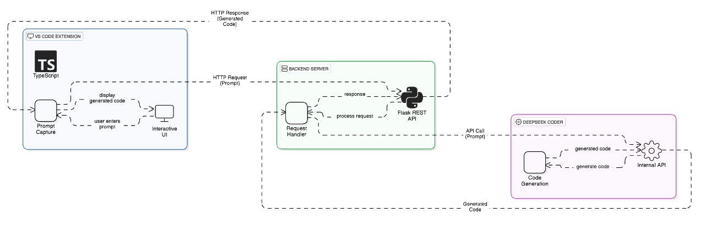

# 🚀 CodeGenie – Your AI-Powered Coding Assistant

## 📌 Introduction  
**CodeGenie** is a lightweight Visual Studio Code extension that brings AI-powered coding assistance into your development workflow. Built on the open-source DeepSeek-Coder model family and developed using an **NVIDIA RTX 4090**, it offers:

- **Intelligent Snippets** – Insert context-relevant boilerplate or custom code with a single command  
- **Auto-completion** – Real-time, context-aware code completion as you type  
- **Code Suggestions** – High-quality AI recommendations tailored to your project

CodeGenie provides intelligent coding assistance with real-time model access over the internet. While your code context is sent for processing, no data is stored or logged, ensuring a privacy-conscious experience for developers.  

_CodeGenie doesn't change your entire project. It assists you—precisely where and when you need it._  

---

## 🎯 Purpose of the Project  
1. **Accelerate Development**  
   - Reduce time spent writing repetitive code through smart, context-aware generation.  
2. **Minimize Distractions**  
   - Avoid switching tabs or searching documentation—get inline help as you code.  
3. **Enhance Security & Compliance**  
   - Keep all inference on-premises using your GPU (e.g., RTX 40-series), ensuring complete control.  
4. **Improve Code Quality**  
   - Provide style-consistent, best-practice suggestions without enforcing full-project changes.

---

## 🌍 Applications of the Project  

| Scenario                      | How CodeGenie Helps                                                  |
|-------------------------------|----------------------------------------------------------------------|
| **Rapid Prototyping**         | Quickly scaffold code structures using intelligent snippet inserts.  |
| **Focused Coding**            | Auto-complete code blocks without needing external lookup.           |
| **Multi-language Support**    | Get suggestions across Python, TypeScript, Java, C++, and more.      |
| **Secure Development**        | All features work offline using local inference on RTX 40 GPUs.      |
| **Increased Productivity**    | Generate helper functions, config templates, or interface definitions instantly. |

---

## 🚀 Architecture Diagram  
  

---

## 🧠 Workflow  
1. **User Input**  
   - CodeGenie listens to keystrokes and understands surrounding file context.  
2. **Context Encoding**  
   - Processes project-level context up to 16K tokens (scalable to 64K).  
3. **Model Inference**  
   - DeepSeek-Coder-Instruct generates completions, snippets, or suggestions.  
4. **Suggestion Display**  
   - Results appear as inline completions, side-panel inserts, or smart prompts in the editor.

---

## 📖 Research Foundations  

### 🔬 DeepSeek-Coder  
Transformer-based models (1.3B–33B parameters) trained on vast codebases. Includes:  
- **Fill-in-the-Middle (FIM)** for mid-block insertions  
- **Enhanced RoPE encodings** for long-context capabilities  
- **Instruction tuning** for task-guided completions  

### 🧠 DeepSeek-Coder-Instruct  
A fine-tuned variant designed for:  
- Structured suggestions based on developer intent  
- Multi-step code generation workflows  
- Intelligent error resolution and API usage hints  

---
